# Synapto Catcher User Guide

Welcome to the Synapto Catcher program! This guide will help you navigate through the features and functionalities of the software.

## Overview
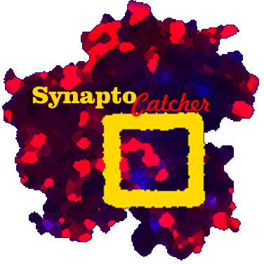

Synapto Catcher is designed to process and analyze images. The program interface is divided into several sections, each dedicated to a specific step in the image processing workflow. The console at the bottom displays the progress and results of each processing stage, with links to the output files.

## Instructions

### 1. Select File
To get started for the first time, you need to select a CSZ image file or a table with a list of CSZ files in Excel table.

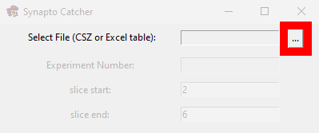

- **Select File:** Click the browse button and navigate to the directory containing your image files. Select the desired **Excel spreadsheet based protocol** or **CSZ** picture file.

#### Working with Excel table
The table allows to process a large number of images at once.

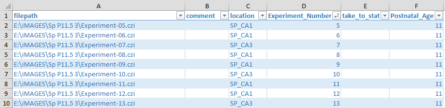

Currently, the table must necessarily contain the columns: **filepath, comment, location, Experiment_Number, take_to_stat, Postnatal_Age**. 
- **filepath:** must contain direct paths to the CZI file. For example “C:\data\Experiment-500.czi”.
- **Experiment_Number:** should contain the number of the experiment, e.g. 500. You can write a list or a range of desired experiments.

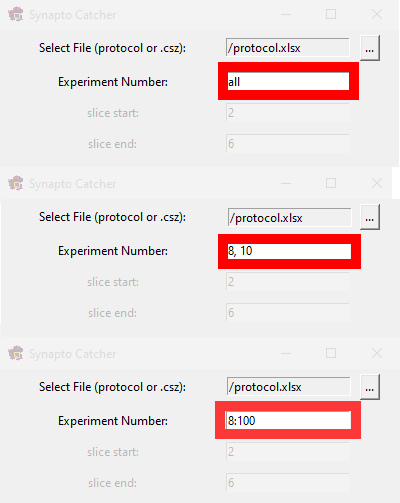

- **take_to_stat:** can be empty, but if there is the word 'no' in any line, the experiment on that line will be excluded from processing.

Columns **comment**, **location**, **Postnatal_Age** can be left empty.
### 2. Set Experiment Parameters
- **Experiment Number (only if Excel table is selected):** Enter the experiment number associated with the images.
- **slice start:** Specify the starting slice number.
- **slice end:** Specify the ending slice number.

### 3. Select ROI

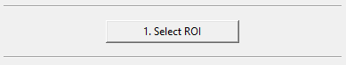
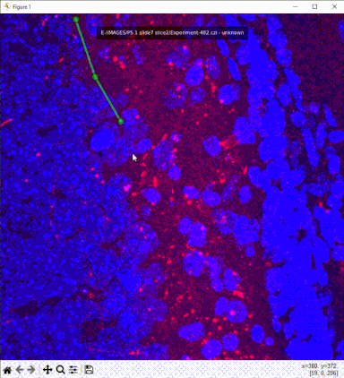

- **Select ROI:** Click this button to select the Region of Interest (ROI) for your images.

### 4. Filter Images
Synaptotagmin channel filtering, the next necessary step to isolate synapses of a specific size. The filtering radius can be adjusted to remove noise and to set the desired size of synapses.

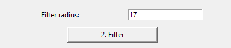
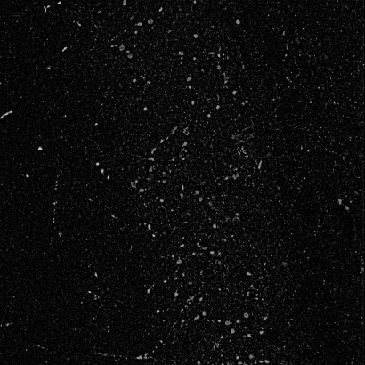

- **Filter radius:** Enter the desired filter radius (pixels) value.
- **Filter:** Click this button to apply the filter to the images based on the specified radius.

### 5. Binarize Images
During binarization, we get a black and white image. One of the selected binarization methods allows you to define the brightness cutoff threshold. In the end, however, we only see the result inside the region of interest.

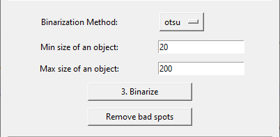
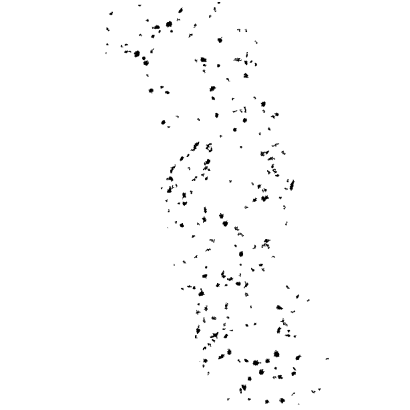

- **Binarization Method:** Choose the binarization method (e.g., otsu) from the dropdown menu.
- **Min size of an object:** Specify the minimum size (pixels) of objects to be considered.
- **Max size of an object:** Specify the maximum size (pixels) of objects to be considered.
- **Binarize:** Click this button to binarize the images based on the chosen parameters.

- **Remove bad spots:** Click this button to remove unwanted spots from the binarized images.

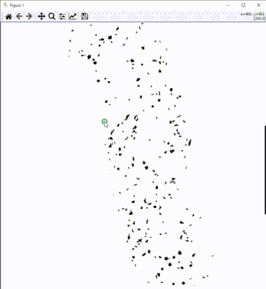

### 6. Combine Images
After combining, we can simultaneously see three results at the same time. On the first photo is the original image with region of interest, on the second photo is the filtered version, and on the third photo is the result of binarization.

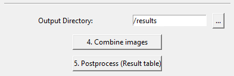
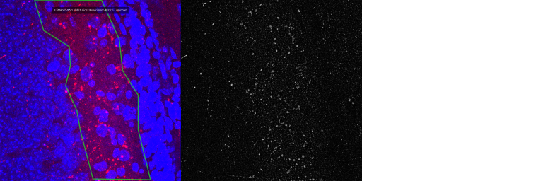

- **Output Directory:** Specify the output directory where the processed images will be saved.
- **Combine images:** Click this button to combine the images as per the defined parameters.

### 7. Postprocess
Postprocessing provides a table that contains all the computed information for each experiment.

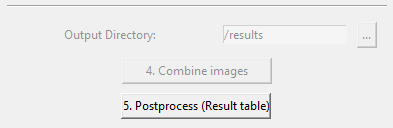
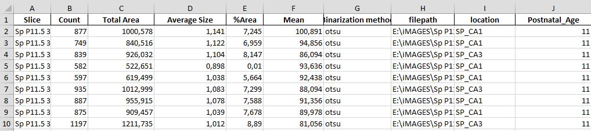

- **Postprocess (Result table):** Click this button to generate the result table from the processed images.

## Console
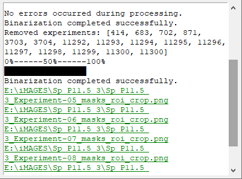

The console at the bottom of the interface provides updates on the progress of each processing stage. It displays messages indicating the successful completion of each step and provides links to the resulting files. You can click these links to open and view the results.

---

Follow these steps to efficiently process and analyze your images using Synapto Catcher. If you encounter any issues or have questions, please contact me.

---

### Example Workflow

1. **Select File:**
   - Click the browse button and select CSV file `"C:\data\Experiment-500.czi"`.
   
2. **Set Experiment Parameters:**
   - Experiment Number: (Leave blank if not applicable)
   - slice start: 2
   - slice end: 6

3. **Select ROI:**
   - Click `Select ROI` and define your region of interest.

4. **Filter Images:**
   - Filter radius: 17
   - Click `Filter`.

5. **Binarize Images:**
   - Binarization Method: otsu
   - Min size of an object: 20
   - Max size of an object: 200
   - Click `Binarize`.
   - Click `Remove bad spots` if necessary.

6. **Combine Images:**
   - Output Directory: `E:/IMAGES/PS.1_slide7`
   - Click `Combine images`.

7. **Postprocess:**
   - Click `Postprocess (Result table)`.

The console will display the progress and provide links to the output files for review.
