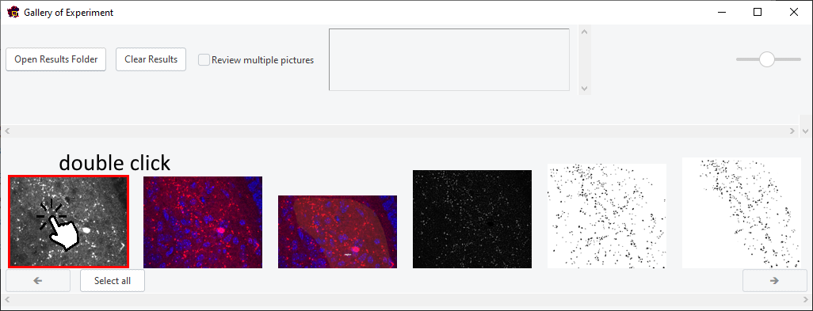

# Synapto Catcher User Guide
Welcome to the Synapto Catcher! This guide will help you navigate through the features and functionalities of this image processing software.

## Getting Started
### Opening files

To get started, you need to select an image file. Click the browse
button and navigate to the directory containing your image files. Select
the desired picture file.

## Settings

### Stacking Parameters {#stacking-parameters .unnumbered}

Since the images are multi-layered, you need to select the range of
layers to be stacked "**slice start**" (the first slice number),
"**slice end**" (the last slice number). You can also check the
"**select all slices**" checkbox to use the entire range of layers.
Select "**target_ch**", this is the channel that we analyze. Sometimes
it makes sense to select an "**additional channel**", this channel can
help visualize some data more easily, but this channel is not analyzed.
Select "**pixel_to_micron_ratio**", this ratio will allow you to
precisely calculate the area occupied by objects in "**target_ch**".

### Filtering {#filtering .unnumbered}

Filtering helps to remove background noise and to set the desired size
of the objects (spots). For example, if you know that the radius of
objects should be about 17 pixels, then set the filtering radius to be
the same.

### Binarization {#binarization .unnumbered}

Binarization will give a black and white image on which the objects we
need will be indicated in black. Choose the "**binarization method"**
(e.g., otsu) from the dropdown menu. Specify the "**minimum size"** and
the "**maximum size"** of an object. These size options will allow you
to keep objects that fall within this area range.

## Data processing

### Region selection {#region-selection .unnumbered}

Click "**1. Mark region**" button to choose the Region of Interest (ROI)
for the current image.

Come up with a name for the region, by default just "**region**" and
click OK button.

Once you do this, the target image will open. In order to start
selecting ROI you need to click on the \"**Start**\" button.

After clicking on \"Start\", you need to start drawing the region you
want to analyze.

When you finished drawing the region, you can start over by clicking on
"**Delete**", you can accept the region by clicking on "**Apply**" and
precisely modify the region by clicking on "**Modify**".

### Filtering and binarization {#filtering-and-binarization .unnumbered}

To filter and binarize the selected region and get the results of object
counting, click on "**2. Filter and Binarize**" button. Filtering and
binarization will be performed according to the settings you have set.
If the first step of selecting regions was done correctly, you will see
a message in the console at the bottom that the "**binarization was
successful**".

## Exploring results

Once you have completed all the data processing steps, you can look at
the results by double-clicking on the preview of your image.

After that, a gallery of results will open.

By double-clicking on the previews of the results, you can take a better
look at them.

 And if you want to see the results files,
click on the \"**Open Results Folder**\" button. In that folder with the
results you will find not only pictures with the steps, but also tables
with the results of area calculations, and additionally tables with the
coordinates of the selected regions.
