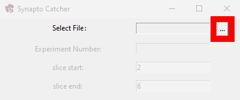
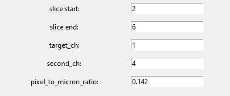
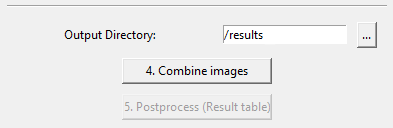
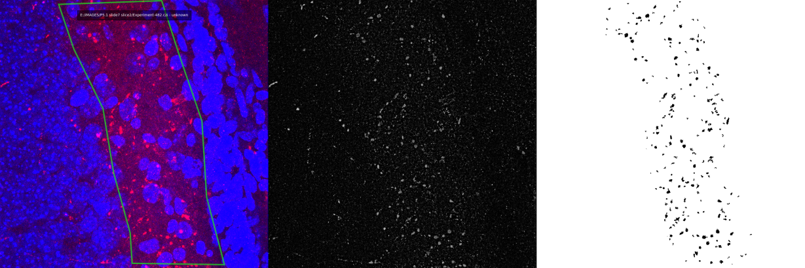
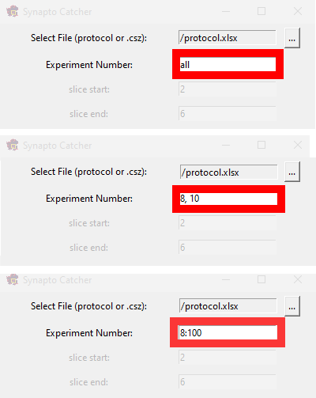

# Synapto Catcher User Guide

Welcome to the Synapto Catcher! This guide will help you navigate through the features and functionalities of this image processing software.

## Overview
Synapto Catcher is designed to automatically find and select synaptonagmin on CSZ format image. 

## Download
[Download Installer for Windows](https://sourceforge.net/projects/synapto-catcher/files/synapto_catcher_setup.exe/download)

## Getting Started

### Select File
To get started for the first time, you need to select an image file (CSZ or LIF) or a table with a list of CSZ files in Excel table (see [Working with Excel table](#working-with-excel-table)
).

- **Select File:** Click the browse button and navigate to the directory containing your image files. Select the desired **CSZ** picture file or **Excel table**.

### Stacking Parameters
Specify the range of layers to be stacked.

- **slice start:** the first slice number.
- **slice end:** the last slice number.
- **target_ch:** synaptotagmin channel.
- **second_ch:** DAPI or other channel (without analysis).
- **pixel_to_micron_ratio:** the pixel to micron ratio.

## Image Analysis
All steps described below are necessary to obtain statistics on synaptotagmin in the CSZ image.
If you are [working with an Excel table](#working-with-excel-table), each processing step is performed for each experiment selected in the “Experiment Number” field.
### 1. Select ROI
Click **Select ROI:**  button to choose the Region of Interest (ROI) for the current image.
The ROI and the image with superimposed region will be saved in the folder with the CSZ image that is being processed.

### 2. Filter Images
Synaptotagmin channel filtering, the next necessary step to isolate synapses of a specific size. The filtering radius can be adjusted to remove noise and to set the desired size of synapses.

- **Filter radius:** Enter the desired filter radius (pixels) value.
- **Filter:** Click this button to apply the filter to the images based on the specified radius.

### 3. Binarize Images
During binarization, we get a black and white image. One of the selected binarization methods allows you to define the brightness cutoff threshold. In the end, however, we only see the result inside the region of interest.

- **Binarization Method:** Choose the binarization method (e.g., otsu) from the dropdown menu.
- **Min size of an object:** Specify the minimum size (pixels) of objects to be considered.
- **Max size of an object:** Specify the maximum size (pixels) of objects to be considered.
- **Binarize:** Click this button to binarize the images based on the chosen parameters.

- **Remove bad spots:** Click this button to remove unwanted spots from the binarized images.

### 4. Combine Images
After combining, we can simultaneously see three results at the same time. First is the original image with region of interest, second image is the filtered version from synaptotagmin channel, and on the third image is the result of binarization inside the region of interest.

- **Output Directory:** Specify the output directory where the processed images will be saved.
- **Combine images:** Click this button to combine the images.

### 5. Postprocess
Postprocessing provides a table that contains all computed results.

- **Postprocess (Result table):** Click this button to generate the result table from the processed images.
It will be saved in Excel format to the Output Directory specified earlier.

## Log window
The log window at the bottom of the interface provides updates on the progress of each processing stage. It displays messages indicating the successful completion of each step and provides links to the resulting files. You can click these links to open and view the results.

---

# Working with Excel table
The table allows to process a large number of images at once.

Currently, the table must necessarily contain the columns: **filepath, comment, location, ID, take_to_stat, Group**. 
- **filepath:** must contain direct paths to the CZI file. For example “C:\data\Experiment-500.czi”.
- **ID:** should contain the number of the experiment, e.g. 500. 
- **take_to_stat:** can be empty, but if there is the word 'no' in a line, the experiment on that line will be excluded from processing.

Columns **comment**, **location**, **Group** can be left empty.

## Selecting experiments when working with an Excel table

You can write a list or range of desired experiments. See examples below. 
- You can simply write **"all"** then all experiments in the table will be processed. 
- You can separate the numbers with commas, for example if you write **"8, 10"** then two experiments number 8 and number 10 will be processed. 
- You can write the range in start:stop format, for example if you write **"8:100"** then all experiments from 8 to 100 will be taken. 

---

Follow these steps to efficiently process and analyze your images using Synapto Catcher. If you encounter any issues or have questions, please contact me [ta3map@gmail.com](mailto:ta3map@gmail.com?subject=SynaptoCatcher).
